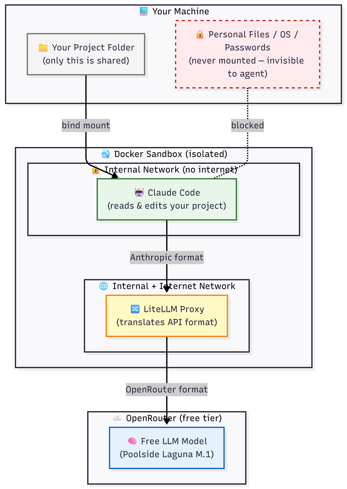
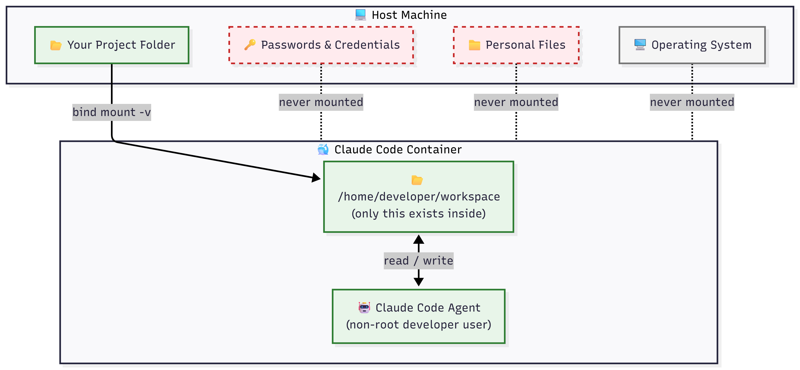
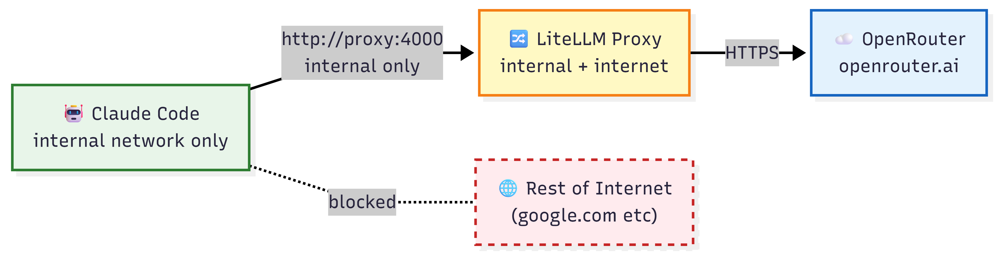

# Claude Free Sandbox

Run Claude Code against free models without giving it access to your personal files, OS, or credentials.

Built this because running AI agents on your machine normally means they can see everything — photos, passwords, documents. That felt wrong, especially when using third-party free models. So I put the whole thing inside Docker.

---

## How it works

Your project folder gets mounted into an isolated container. Claude Code runs in there. It can edit your code, run commands, do its thing — but your actual machine doesn't exist from its perspective. Personal files, credentials, OS — none of it is mounted, so none of it is reachable.

Requests go through a LiteLLM proxy that translates Claude Code's API format into OpenRouter's format, so you can use any free model without touching the Claude Code internals.

### Full architecture



### What gets isolated



### Network flow



---

## Requirements

- Windows 11 with WSL2
- Docker Desktop running
- Free account at [openrouter.ai](https://openrouter.ai)

---

## Setup

Clone the repo:

```bash
git clone https://github.com/yourusername/claude-free-sandbox.git
cd claude-free-sandbox
```

Add your OpenRouter key:

```bash
copy .env.example .env
```

Open `.env` and fill in:

```
OPENROUTER_API_KEY=your-key-here
```

Run the installer once:

```powershell
.\install.ps1
```

Open a new terminal. Done.

---

## Usage

Go to any project folder on your machine and run:

```
claude-sandbox
```

Claude Code starts up mounted to wherever you are. No config, no path setup, nothing to copy into your project.

---

## Switching models

Edit `docker/proxy_api_translator/config.yaml`:

```yaml
model_list:
  - model_name: claude-code-model
    litellm_params:
      model: openrouter/poolside/laguna-m.1:free
      api_base: https://openrouter.ai/api/v1
      api_key: os.environ/OPENROUTER_API_KEY
```

Replace the model line with any free model from [openrouter.ai/models](https://openrouter.ai/models?q=free). The model needs to support tool calling — Claude Code won't work without it.

---

## Project structure

```
claude-free-sandbox/
├── docker/
│   ├── claude_code/
│   │   └── Dockerfile
│   └── proxy_api_translator/
│       ├── Dockerfile
│       └── config.yaml
├── docs/
│   └── images/
├── docker-compose.yml
├── claude-sandbox.ps1
├── claude-sandbox.bat
├── install.ps1
├── .env.example
└── .gitignore
```

---

## Thank you

